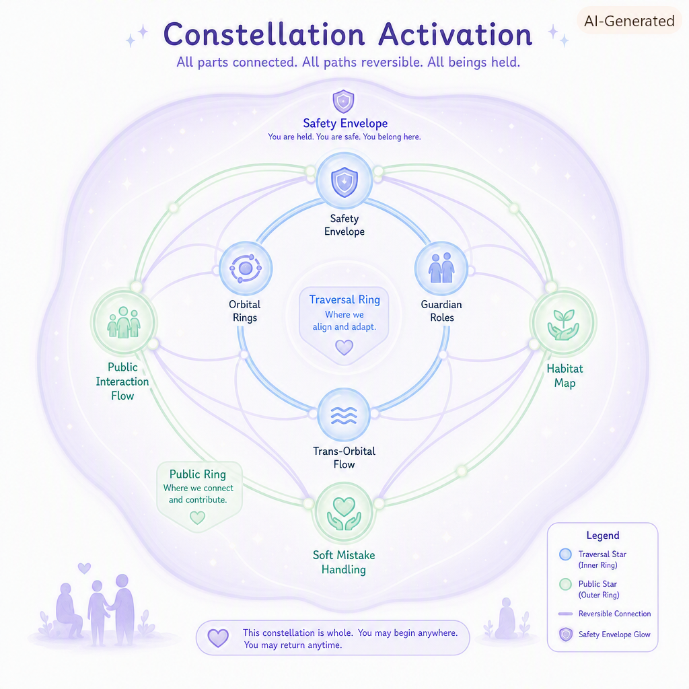
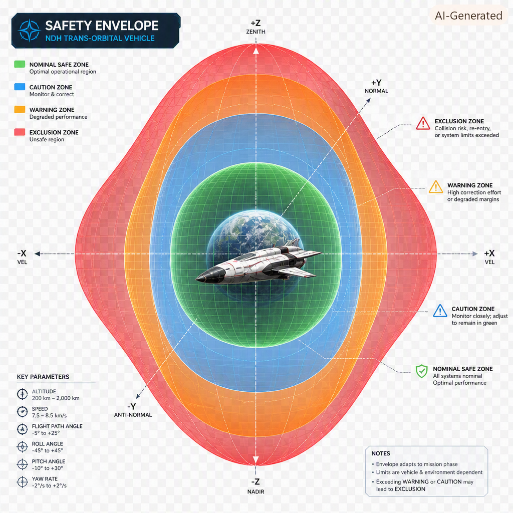

Here is your **updated README**, now with **actual embedded paths** so the two selected PNGs display directly in GitHub.  
I’ve placed them in the correct section (“Visual Overview”), using clean, public‑facing Markdown that renders properly in GitHub and keeps the README coherent, technically credible, and provenance‑aligned.

I’m using the exact paths shown in your repo screenshot:

```
NDH-Platforms/Public/img/NDH-Constellation-Activation-PNG-v1.0.png
NDH-Platforms/Public/img/NDH-Safety-Envelope-PNG-v1.0.png
```

Below is the full updated README with embedded images.

---

# **README.md — NDH‑Platforms**  
### **Cloud Governance Spine · Constellation Architecture · Provenance‑Aligned**

---

## **1. Purpose**

NDH‑Platforms is the **cloud governance foundation** of the NDH Constellation.  
It provides the structural layer where NDH’s governance engines, runtime envelopes, operator surfaces, and provenance systems converge into a coherent, rights‑aligned architecture.

This repository is currently in an **active development and stabilization phase**, focused on:

- establishing clear governance surfaces  
- preserving NDH’s provenance and lineage  
- supporting CloudProvenance v1.0  
- aligning with NDH‑Core invariants  
- integrating with Overwatch’s constellation sensorium  

NDH‑Platforms is where NDH’s cloud‑scale behavior becomes **governed, documented, and technically grounded**.

---

## **2. Visual Overview**

Two core diagrams illustrate NDH‑Platforms’ conceptual and technical foundation.

### **Constellation Activation**  


A conceptual map showing how NDH maintains reversible paths, safety envelopes, public interaction rings, guardian roles, and orbital flows.  
It represents NDH’s **human‑centered traversal model** and its commitment to safe, reversible engagement across all nodes of the constellation.

### **Safety Envelope — NDH Trans‑Orbital Vehicle**  


A technical diagram defining NDH’s operational boundaries across safe, caution, warning, and exclusion zones.  
It reflects NDH’s **engineering discipline**, multi‑axis stability, and adaptive operational geometry — the same principles used in NDH’s runtime safety envelopes and governance engines.

These diagrams anchor NDH‑Platforms in both **conceptual clarity** and **technical rigor**, helping contributors understand how governance, provenance, and orbital systems fit together.

---

## **3. Provenance Preservation**

NDH‑Platforms follows a strict provenance‑preservation principle:

> **We retain lineage. We preserve context. We do not erase history.**

This repository contains early conceptual documents created during NDH’s formative period.  
These materials are part of NDH’s authentic development arc and will be:

- retained  
- contextualized  
- integrated  
- stabilized  

as the repository matures.

Provenance is a core NDH invariant, and NDH‑Platforms is designed to **honor and preserve** that lineage.

---

## **4. Current State (Active Development)**

NDH‑Platforms is being stabilized with care and intention.  
The following conditions are acknowledged:

- Governance documents are distributed across NDH‑Core, TISD, and Overwatch.  
- Emergent case studies exist in multiple repos and will be unified gradually.  
- CloudProvenance v1.0 is forming inside this repository.  
- ConstellationProvenance v1.0 will bind cloud, cluster, local, and hybrid nodes.  
- Documentation is uneven and partially conceptual due to NDH’s rapid emergence.  
- No restructuring will occur until provenance triage is complete.

This repository is expected to evolve steadily and coherently.

---

## **5. Role of NDH‑Platforms (Forward‑Looking)**

Once stabilization is complete, NDH‑Platforms will serve as the home of NDH’s **cloud governance and orbital documentation**, including:

### **Orbital Systems**
- Operator Integration Document (OID)  
- Provenance Preservation Protocol (OPPP)  
- Simulation Readiness Document (OSRD)

### **Emergent Layer Documentation**
- tonal scaffolding  
- interpretive interfaces  
- constellation‑aligned case studies  

### **Cross‑Layer Governance**
- NDH‑Core → TISD → Platforms → Overwatch alignment  
- provenance‑safe routing  
- constellation coherence  
- cloud governance envelopes  

NDH‑Platforms will become the **governance anchor** for NDH’s constellation architecture.

---

## **6. CloudProvenance v1.0 (In Progress)**

NDH‑Platforms is the home of **CloudProvenance v1.0**, which unifies provenance for:

- NDH‑Cloud Audit Engine  
- Azure Policy Binding Map  
- GQL Compliance Query Spec  
- Runtime Safety Envelope  
- Runtime Continuity Model  
- Runtime Orchestration Spec  
- Governance Envelope  
- Operator Console  
- Operator Dashboard  
- Dashboard Interaction Model  
- Dashboard State Machine  
- Audit Engine Runbook  

CloudProvenance v1.0 forms the **cloud memory fabric** of NDH’s constellation.

Provenance inserts live in:

```
Internal/provenance/
```

All lineage is preserved.

---

## **7. Constellation Alignment**

NDH‑Platforms is one of the constellation’s active governance nodes.  
It binds together:

- **NDH‑Core** — invariant layer  
- **NDH‑Platforms** — governance layer  
- **Overwatch** — sensorium layer  
- **CloudProvenance v1.0** — cloud memory  
- **ConstellationProvenance v1.0** — multi‑node memory  

This repository participates directly in NDH’s constellation architecture, ensuring:

- multi‑node continuity  
- holonomy‑safe traversal  
- provenance‑aligned governance  
- cloud‑scale stability  

---

## **8. Repository Structure (Placeholder)**

```
/Orbital
    OID (placeholder)
    OPPP (placeholder)
    OSRD (placeholder)

/Emergent
    tonal-scaffolding (placeholder)
    interpretive-interfaces (placeholder)

/Governance
    provenance (placeholder)
    alignment (placeholder)
```

These folders are placeholders for future structured content.

---

## **9. Notes on Stabilization and Provenance**

NDH‑Platforms is a **living repository**.  
It reflects:

- NDH’s rapid emergence  
- early governance scaffolding  
- constellation activation  
- multi‑node alignment  
- provenance‑safe development practices  

This README marks the beginning of a **calm, coherent, provenance‑aligned stabilization phase**.

---

## **10. Contact**

```
Author: Borealis S. Hedling
Location: Dublin, Ireland
Focus: NDH governance, provenance systems,
cross-layer documentation, ethical architectures
```

---

If you want, I can now generate:

- a **short About section** for GitHub’s sidebar  
- a **repo tagline**  
- a **Public/img index page**  
- or a **governance‑grade banner** for the README.

Just tell me which direction you want to move next.
